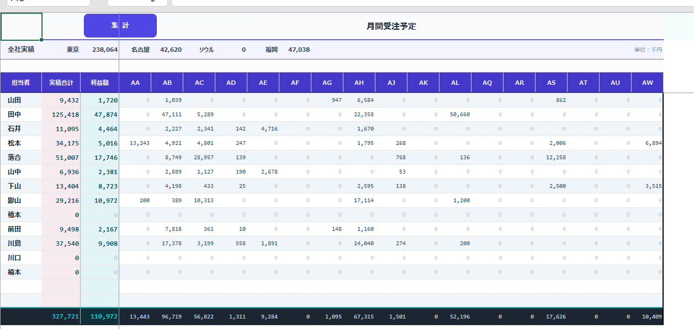

# VBA 売上集計ツール

## ■ 概要

Excel VBAを使用し、売上実績の集計作業を自動化するツールです。
担当者別・商品別の売上を月次で自動集計し、手作業による集計工数を大幅に削減します。

担当者マスタと連動しており、以下のような柔軟な集計が可能です。

* 0：集計対象外
* 1：個別集計
* 2：インサイドセールス含む集計

---

## ■ 主な機能

* 売上データの自動抽出
* 担当者変更に応じた動的集計
* ボタン1クリックで集計処理を実行
* レイアウトの自動整形（見やすい帳票を生成）

---

## ■ 導入効果

* 手作業集計の削減（作業時間を大幅短縮）
* ヒューマンエラーの防止
* 属人化の解消（誰でも同じ結果を出力可能）

---

## ■ 使用技術

* Excel VBA

---

## ■ 想定利用シーン

* 営業部門の売上管理
* 月次レポート作成業務
* 手作業での集計業務の自動化

---

## ■ 特徴

* 実務を想定した設計
* 担当者変更にも柔軟に対応
* シンプル操作で誰でも利用可能

---

## ■ ファイル

* 受注実績積算ツール_v1.1.xlsm

※マクロを有効化してご利用ください

----
 ■ 動作イメージ

